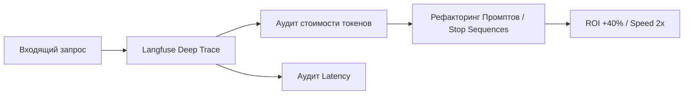

# llm-observability-audit


# LLM Observability & Audit: Оптимизация затрат на базе Langfuse


**Executive Summary:** Фреймворк для мониторинга, отладки и финансового контроля AI-инфраструктуры компании.

## 📊 1. Бизнес-результаты и Метрики
| Метрика | До аудита («Слепая» работа) | После рефакторинга | Бизнес-эффект |
| :--- | :--- | :--- | :--- |
| **Затраты на API (OPEX)** | 100% | 60% | **-40% расходов** |
| **Задержка ответа (Latency)** | 2.8 - 3.2 сек | 1.2 - 1.5 сек | **Ускорение в 2 раза** |
| **Контроль цепочек мыслей** | Нет (Черный ящик) | Тотальный трейсинг | **Выявление узких мест** |

## 🏗 2. Бизнес-контекст и Ограничения
*   **Ситуация:** Бесконтрольная эксплуатация множества ИИ-агентов в бизнес-процессах.
*   **Ограничения:** Отсутствие прозрачности расходов и качественных характеристик ответов («Черный ящик»). Непредсказуемая задержка ответов (Latency), влияющая на лояльность пользователей.
*   **Инженерный вызов:** Внедрение системы сквозного логирования (Tracing) для декомпозиции цепочек рассуждений ИИ на атомарные шаги с замером стоимости каждого токена.

## ⚙️ 3. Техническая архитектура
Внедрен паттерн **Prompt Refactoring** на основе данных телеметрии. Замена свободного генерирования (Verbose) на строгие чеклисты снизила генерацию мусорных токенов.



**🛡 4. Безопасность и 152-ФЗ (RU-Стек)**

Langfuse развернут в Self-hosted режиме (локально). Все логи диалогов сотрудников остаются внутри компании и не попадают на внешние серверы аналитики. Система работает асинхронно, не замедляя основного бота.

> 🗣 Мнение Операционного директора: "Денис "подсветил" работу ИИ, и мы увидели, где теряем деньги. Половина бюджета уходила на то, чтобы бот "рассуждал сам с собой" в скрытом режиме. Оптимизировали структуру — бот полетел, а счета уменьшились."

**🤝 Как мы можем сотрудничать?**

- ✅ Проведу аудит стоимости и скорости вашей текущей ИИ-инфраструктуры.
- ✅ Внедрю систему Observability для контроля каждого цента, потраченного на API.
- ✅ Внедрение через Shadow Mode (без остановки бизнес-процессов).

**Связаться для аудита:** Telegram @dks_persistent_bot  
*(Работа по договору, NDA, DPA)*
```
