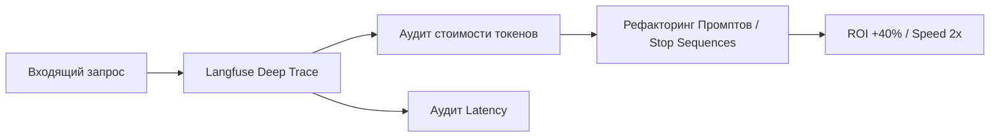

# llm-observability-audit


# LLM Observability & Audit: Оптимизация затрат на базе Langfuse


## 📌 1. О проекте 
**Какую проблему решаем?** 
При активном внедрении ИИ в компанию руководство сталкивается с двумя проблемами: счета за использование нейросетей неконтролируемо растут, а боты периодически "зависают", заставляя пользователей ждать ответ по 5 секунд. ИИ работает как "черный ящик" — непонятно, на что именно уходят деньги и время.

**Что делает этот проект:** 
Это внедрение системы тотального контроля (Observability). Мы "просвечиваем" работу ИИ, записывая каждый его шаг. На основе этих данных мы находим "узкие места" (например, когда ИИ тратит 50% денег на то, чтобы "поговорить сам с собой" в скрытом режиме), оптимизируем инструкции и делаем работу ИИ быстрой и прозрачной.

## 📊 Бизнес-результаты и Метрики
| Метрика | До аудита («Слепая» работа) | После рефакторинга | Бизнес-эффект |
| :--- | :--- | :--- | :--- |
| **Затраты на API (OPEX)** | 100% | 60% | **-40% расходов** |
| **Задержка ответа (Latency)** | 2.8 - 3.2 сек | 1.2 - 1.5 сек | **Ускорение в 2 раза** |
| **Контроль цепочек мыслей** | Нет (Черный ящик) | Тотальный трейсинг | **Выявление узких мест** |

## 🏗 Бизнес-контекст и Ограничения
*   **Ситуация:** Бесконтрольная эксплуатация множества ИИ-агентов в бизнес-процессах.
*   **Ограничения:** Отсутствие прозрачности расходов и качественных характеристик ответов («Черный ящик»). Непредсказуемая задержка ответов (Latency), влияющая на лояльность пользователей.
*   **Инженерный вызов:** Внедрение системы сквозного логирования (Tracing) для декомпозиции цепочек рассуждений ИИ на атомарные шаги с замером стоимости каждого токена.

**Executive Summary:**  
Фреймворк для мониторинга, отладки и финансового контроля AI-инфраструктуры компании.

---

## 🔒 2. Статус проекта и Развертывание (NDA)

> **⚠️ NDA Status:** Исходный код корпоративных ботов защищен NDA. В репозитории представлена методология мониторинга (FinOps) и архитектура трассировки (Tracing).

**Архитектура безопасного мониторинга:**
Для соблюдения законов о защите данных (152-ФЗ), платформа мониторинга может быть развернута полностью on-premise (локально в Docker).

*Пример интеграции трассировки на уровне кода (без замедления основного бизнес-процесса):*
*Пример интеграции трассировки на уровне кода (без замедления основного бизнес-процесса):*
```python
from langfuse.decorators import observe

# Декоратор @observe асинхронно отправляет метрики стоимости и задержки в Langfuse,
# не блокируя выполнение функции для конечного пользователя.
@observe(name="Core_Decision_Logic")
async def generate_business_response(user_query: str, context: dict):
    # Бизнес-логика...
    pass
```
## 🛠 3. Стек технологий  
**Langfuse: Платформа LLM Observability:**  
Позволяет визуализировать деревья выполнения запросов (Chain-of-Thought), считать стоимость токенов до цента и замерять Latency (задержку) на каждом узле архитектуры.  
**LangChain:**  
Стандарт де-факто для построения сложных ИИ-цепочек, имеющий нативную интеграцию с системами мониторинга.  
**Python (FastAPI):**  
Обеспечивает асинхронную обработку телеметрии без ущерба для скорости основного приложения.


## ⚙️ 4. Техническая архитектура
Внедрен паттерн **Prompt Refactoring** на основе данных телеметрии. Замена свободного генерирования (Verbose) на строгие чеклисты снизила генерацию мусорных токенов.



## 🛡 5. Безопасность и 152-ФЗ (RU-Стек)

Langfuse развернут в Self-hosted режиме (локально). Все логи диалогов сотрудников остаются внутри компании и не попадают на внешние серверы аналитики. Система работает асинхронно, не замедляя основного бота.

> 🗣 Мнение Операционного директора: "Денис "подсветил" работу ИИ, и мы увидели, где теряем деньги. Половина бюджета уходила на то, чтобы бот "рассуждал сам с собой" в скрытом режиме. Оптимизировали структуру — бот полетел, а счета уменьшились."

## 📸 6. Доказательства работы (Proof of Work)
<div align="center">
  
  
  
</div>
<div align="center">
  
  
</div>
<br>
<i>Рис 1. Рефакторинг промпт-структуры: отказ от "свободных рассуждений" в пользу жесткого чеклиста позволил снизить объем output-токенов на 40%.</i>
</p>

**🤝 Как мы можем сотрудничать?**

- ✅ Проведу аудит стоимости и скорости вашей текущей ИИ-инфраструктуры.
- ✅ Внедрю систему Observability для контроля каждого цента, потраченного на API.
- ✅ Внедрение через Shadow Mode (без остановки бизнес-процессов).

**Связаться для аудита:** Telegram @dks_persistent_bot  
*(Работа по договору, NDA, DPA)*
```
